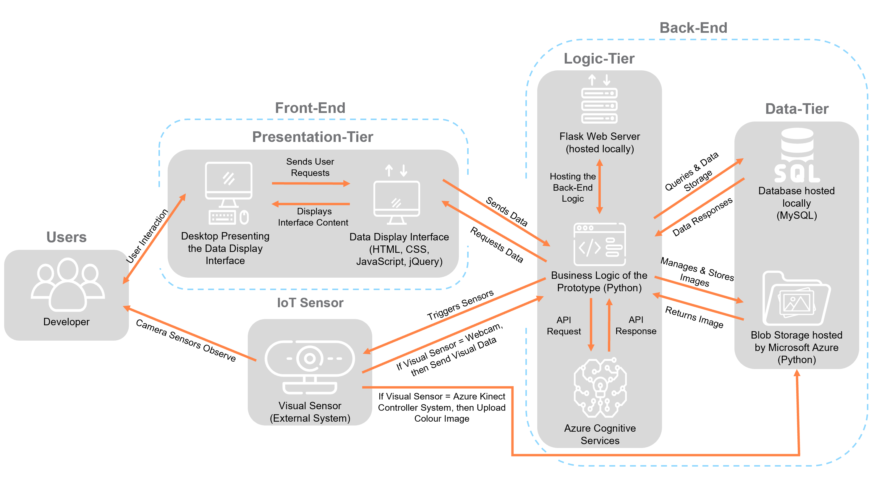

# UCL_IXN_MSc_2020_Project_SmartVision

## What is this project about?

This project aimed to propose and validate a new smart space service, using passive observer technology, for the Modern Workplace Practice of the technology consultancy Avanade. Specifically, the client was interested in learning about potential uses of the Azure Kinect DK sensor. The industry project was divided into a research and proof of concept component.

The research component anchors around the evaluation of potential use cases of the Microsoft Azure Kinect DK and its performance against competitive sensors. Also, insights about the Smart Space/IoT industry and its key players will be collected. The industry analysis revealed that the Smart Space/IoT industry is rapidly growing with strong competitive rivalry among its players. The dominant goal of the sample companies is to develop a plug-and-play IoT platform. A key trend of the players is to advance their analytics solutions to process optimisation systems. The findings of the competitive product mapping showed that the Azure Kinect DK is a highly competitive depth sensor, positioned as a quality leader, scoring the second highest in terms of functionality. Furthermore, the findings highlighted that the Kinect excels in use cases requiring several sensor functionalities. The core research goal regarding the identification of potential use cases for the Kinect DK was answered with five recommendations. These have been developed in the following areas of application: office space, industrial manufacturing and construction sites, retail, and medicine.

Out of the recommended use cases, it was decided to build a proof of concept application for the core functionalities of the office space use case, namely the SmartVision system. It aims to demonstrate new solutions for office space occupation measurement in an unassigned desk environment and sensing employee health through emotion detection. Avanade’s developers were interested that the SmartVision system would employ Azure Cognitive services technologies in connection with the Azure Kinect DK to evaluate their suitability and feasibility for smart space services. The system receives image captures of a workstation from the Kinect DK. This data is then analysed by the SmartVision algorithm. The algorithm uses a scoring system to determine whether a workstation is occupied by analysing the objects present on a desk. It detects the emotions of employees by analysing their facial expressions. The SmartVision algorithm utilizes the Azure Computer Vision and Face service and is complemented by a custom machine learning object detection model. The results of the analysis are stored in a MySQL database and an Azure Blob Storage. The developer team can view statistics of the analysis, as well as control and configure the SmartVision algorithm via a Flask web-application (e.g. adjusting the algorithm’s detection sensitivity). Moreover, the SmartVision system’s modular design enables the client to separately test the technology components and potentially expand the system into a full prototype of the envisioned use case.

## Related

This project was conducted for research, by the Avanade Emerging Technology team.

## What does this repository contain?

This repository contains the research and proof of concept deliverable for the Smart Vision Industry Project with Avanade Inc.:
- [Deployment and User Manual of the SmartVision System](deployment_and_user_manual/SmartVision_ProofOfConcept_DeploymentandUserManuel_Constantin_Ulbrich_vFinalAvanade.pdf)
- [Research Deliverable for the SmartVision Project](research_component/SmartVision_ResearchDeliverable_Constantin_Ulbrich_vFinalAvanade.pdf)
- [COMP0073 SmartVision Project Source Code](src)
  - Azure_Kinect_Controller (Folder containing the source code to control the Azure Kinect DK Sensor and corresponding log files)
  - COMP0073_SmartVision_Prototype (Folder containing all source code components of the SmartVision System, including automated tests)

The Master Thesis associated to this project can be requested from Avanade Inc., UCL, and the author (Constantin Ulbrich).

## Getting Started
In order to implement the project on your own devices, please follow the step by step deployment manual guide (SmartVision_ProofOfConcept_DeploymentandUserManuel_Constantin_Ulbrich_vFinalAvanade.pdf). This document also contains the user manual of the SmartVision system. The following section provides a high level overview on the components and relationships of the system.

## Bill of Materials

### Components & Physical Hardware

- Azure Kinect DK Sensor or an RGB Camera, which can be connect via USB to the local machine (e.g. the local machine's webcam)
- Local machine, which runs on a Windows 10 OS (the Azure Kinect DK has compatibility issues with macOS)
- Azure Services: Azure Computer Vision, Azure Face, Azure Custom Vision, Azure Blob Storage
- Local MySQL database

### Dependencies

The SmartVision System actually consists of two systems: the Azure Kinect Controller System and the SmartVision System. The Azure Kinect Controller System operates the Azure Kinect DK (controlling the sensors) and ensures that the captured sensor data is accessible for the SmartVision System. The SmartVision System contains the SmartVision Algorithm, which is responsible for analyzing the captured data. Additionally, it contains the user interface to control the SmartVision Algorithm, as well as the automated tests for the system.

### System Architecture

Note: The SmartVision System has been programmed in Python, while the Azure Kinect Controller System has been coded in C/C++.

### Software & Libraries

##### Azure Kinect Controller System
The system requires the following SDKs/packages:
- Azure Kinect Sensor SDK
- <k4a/k4a.h>
- <k4arecord/record.h>
- <stdio.h>
- <stdlib.h>
- <was/storage_account.h>
- <was/blob.h>
- <cpprest/filestream.h>  
- <cpprest/containerstream.h>
- < fstream > 

##### SmartVision System 
The system requires a Python interpreter (Python 3.8+) with the following non-standard packages installed:
-	opencv-python 4.4.0.42
-	azure-cognitiveservies-vision-computervision 0.6.0
-	azure-cognitiveservies-vision-customvision 3.0.0
-	azure-cognitiveservies-vision-face 0.4.1
-	azure-storage-blob 12.4.0
-	Pillow (Pillow 7.2.0), a fork of the Python Image Library (PIL)
-	mysql-connector-python
-	unittest
-	matplotlib
-	numpy 
-	Flask 
-	Schedule

Alternatively, the included requirements.txt file contains all the listed libraries. By using the command “pip install -r requirements.txt”, all libraries can be installed at once.

### Development Environment

- SmartVision System: Visual Studio Code
- Azure Kinect Controller System: Visual Studio 2019 (Community Edition)

## Special Notes

- Due to file size limitations on GitHub, the suitable Python Environment, which contained all the necessary libraries, could not be included. Instead a requirements.txt file has been added, which can be executed with the Pip installer to conveniently create your own environment.

- Also due to file size limitations, only the source code and the log files of the Azure Kinect Controller System could be uploaded. For a working prototype, a C++ Visual Studio project has to be created with the name "Azure_Kinect_Controller". Add the source code in a file with precisely the same name as uploaded. Make sure to include the libraries Azure Blob Storage and Azure Kinect Sensor SDK.

- Note, you require the following Azure Cognitive Services to run the proof of concept application: Azure Computer Vision, Azure Face, Azure Custom Vision, Azure Blob Storage. Configure these services in the config.py file in the folder SmartVision_DetectionAlgorithm.

- This project used a custom made detection model to detect objects, which are usually found on a workstation, to support the precision of the detection capabilities of the SmartVision system. Access to this model might be granted if permission is obtained from the author and Avanade.

- In case you are setting up a new blob storage account, the blob storage needs to consist of four containers with the names: "analysedframes", "frames", "lasttakenframe", and "tests".

## Other information

### Who is Avanade?

[Avanade](www.avanade.com) is the leading provider of innovative digital and cloud services, business solutions and design-led experiences on the Microsoft ecosystem, and the power behind the Accenture Microsoft Business Group.

### Emerging Technology

[Avanade Emerging Technologies](https://www.avanade.com/en-gb/thinking/research-and-insights/trendlines) helps clients not only see the future, but create it. Through applied research, experimentation, and collaboration, we empower them to make smart bets and achieve step changes in competitive advantage.

## License
  
MIT License

Copyright (c) 2020 Avanade Inc

Permission is hereby granted, free of charge, to any person obtaining a copy
of this software and associated documentation files (the "Software"), to deal
in the Software without restriction, including without limitation the rights
to use, copy, modify, merge, publish, distribute, sublicense, and/or sell
copies of the Software, and to permit persons to whom the Software is
furnished to do so, subject to the following conditions:

The above copyright notice and this permission notice shall be included in all
copies or substantial portions of the Software.

THE SOFTWARE IS PROVIDED "AS IS", WITHOUT WARRANTY OF ANY KIND, EXPRESS OR
IMPLIED, INCLUDING BUT NOT LIMITED TO THE WARRANTIES OF MERCHANTABILITY,
FITNESS FOR A PARTICULAR PURPOSE AND NONINFRINGEMENT. IN NO EVENT SHALL THE
AUTHORS OR COPYRIGHT HOLDERS BE LIABLE FOR ANY CLAIM, DAMAGES OR OTHER
LIABILITY, WHETHER IN AN ACTION OF CONTRACT, TORT OR OTHERWISE, ARISING FROM,
OUT OF OR IN CONNECTION WITH THE SOFTWARE OR THE USE OR OTHER DEALINGS IN THE
SOFTWARE.
